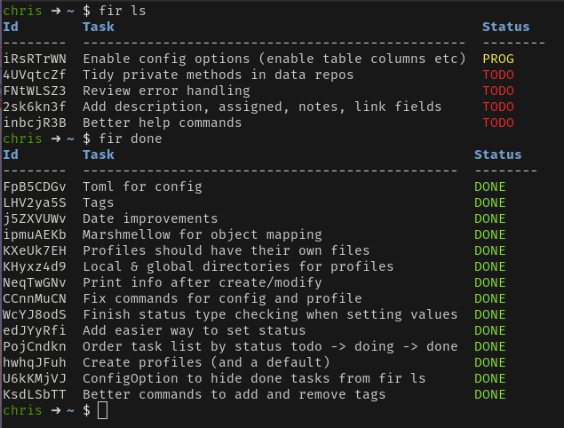
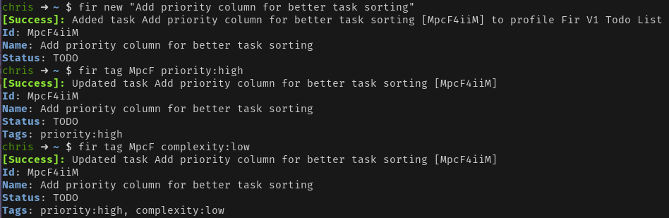

## Fir - Command line task management

<small>Project is in development & subject to breaking changes.</small>

Configurable command line task management tool inspired by emacs org mode & web based task management tools.

### Features
- Support for multiple profiles allowing the user to easily switch between task lists. 
- Toml configuration files, easy for humans and source control. See: [example](./fir.v1.todo.toml)
- Configurable outputs (& more to come)
- Support for tags, due dates, assigned people, notes and more 

### Viewing tasks:

### Creating/Modifying tasks:

